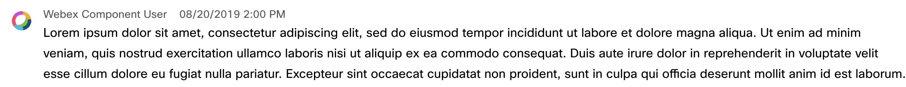

# Webex Activity Component

Webex activity component displays the activity content.

<p align="center">
  
</p>

## Preview

To see all the different possible states of the Webex Activity component, you can run our Storybook:

```shell
  npm start
```

## Embed

1. Create a component adapter from which the data will be retrieved (See [adapters](../../adapters)). For instance:

    ```js
    const jsonAdapter = new WebexJSONAdapter(jsonData);
    ```

2. Create a component instance by passing the activity ID as a string
enclose it within [a data provider](../WebexDataProvider/WebexDataProvider.js)
that takes the [component data adapter](../../adapters/WebexJSONAdapter.js) that we created previously

    ```js
    <WebexDataProvider adapter={jsonAdapter}>
      <WebexActivities activityID="activityID" />
    </WebexDataProvider>
    ```

The component knows how to manage its data. If anything changes in the data source that the adapter manages, the component will also update on its own.
