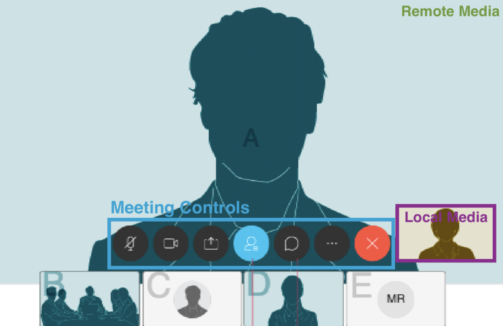

# Webex In-Meeting Component

Webex In-Meeting component displays the [Webex Local Media](../WebexLocalMedia) component on top of the [Webex Remote Media](../WebexRemoteMedia) component for the in meeting media experience.

<p align="center">
  
</p>

## Preview

To see all the different possible states of the Webex Interstitial Meeting component,
you can view our [storybook](https://webex.github.io/components/storybook/?path=/story/webex-inmeeting--remote-and-local-media-enabled)
or run the following **NPM** command:

```shell
  npm start
```

## Embed

1.  Create a component adapter from which the data will be retrieved (See [adapters](../../adapters)). For instance:

    ```js
    const jsonAdapter = new WebexJSONAdapter(jsonData);
    ```

2.  Create a component instance by passing the meeting ID as a string and
    enclose it within [a data provider](../WebexDataProvider/WebexDataProvider.js)
    that takes the [component data adapter](../../adapters/WebexJSONAdapter.js) that we created previously

    ```js
    <WebexDataProvider adapter={jsonAdapter}>
      <WebexInMeeting meetingID="meetingID" />
    </WebexDataProvider>
    ```

The component knows how to manage its data. If anything changes in the data source that the adapter manages, the component will also update on its own.
